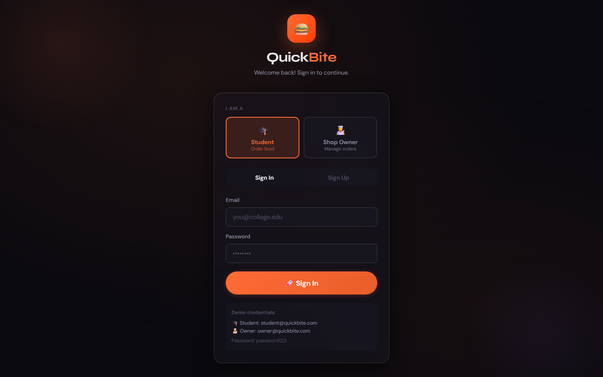
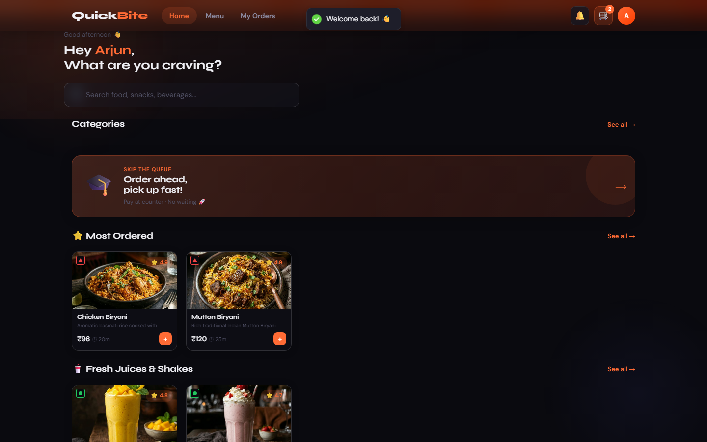
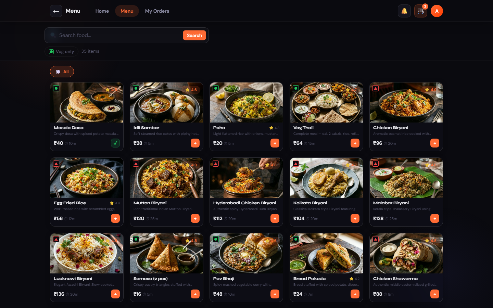
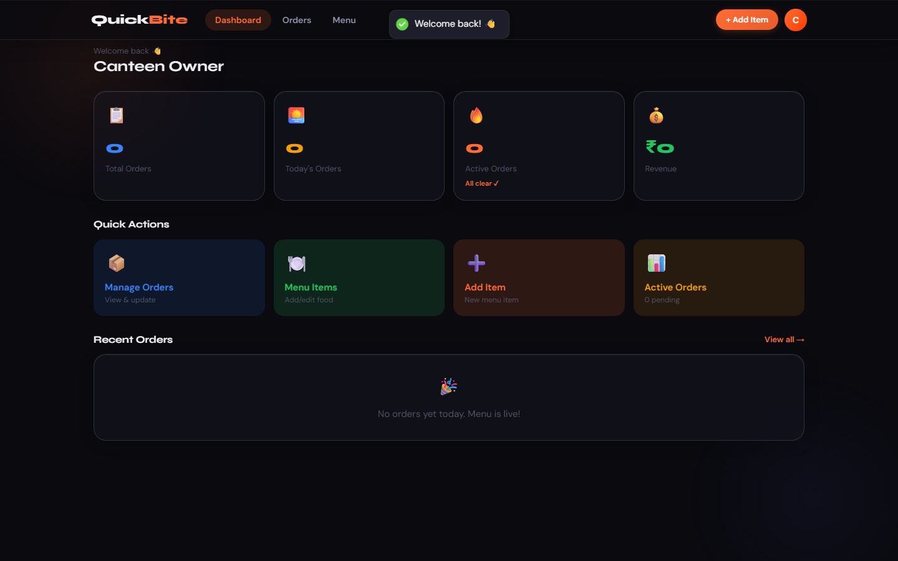

# QuickBite

QuickBite is a full-stack food ordering system built for college canteens. Students browse the day's menu, order ahead from their phone or laptop, and pick up without standing in the lunch-rush queue. Canteen staff get a live dashboard to accept, prepare, and mark orders ready, instead of running everything off a notebook and shouted order numbers.

It's a two-sided app — one experience for students placing orders, another for the canteen owner managing them — backed by a single REST API.

## Screenshots

<table>
  <tr>
    <td></td>
    <td></td>
  </tr>
  <tr>
    <td></td>
    <td></td>
  </tr>
</table>

## Why it's structured this way

A canteen app really has two different jobs to do: a *catalog + checkout* flow for students, and an *operations* view for whoever is cooking. Rather than bolt both onto one generic dashboard, the app splits cleanly by role at login and route level — `customer` and `owner` get entirely different navigation, pages, and permitted API actions. A student can't hit an owner-only endpoint even if they guess the URL; the JWT carries the role and every owner route checks it server-side, not just in the UI.

The other deliberate choice was payment: real campus canteens in India run on cash or UPI-at-the-counter, not card-on-file. So checkout defaults to "pay at the counter," and the UPI/card/wallet options in the UI are there to demonstrate the flow end-to-end (QR code rendering, card input formatting, a processing/success sequence) without wiring up a real payment gateway — there's no Razorpay/Stripe key anywhere in this repo, by design.

## Tech stack

| Layer | Choice |
|---|---|
| Frontend | React 18, React Router v6, Axios, react-hot-toast |
| Styling | Hand-written CSS (custom properties, no Tailwind/MUI) |
| Backend | Node.js, Express |
| Database | MongoDB via Mongoose |
| Auth | JWT (7-day expiry) + bcrypt password hashing |

No CSS framework is used on the frontend — the dark, glassy look (backdrop blur, soft borders, spring-eased transitions) is a small design system defined once in `index.css` as CSS variables and utility classes (`.glass-panel`, `.card`, `.btn`, `.food-grid`, …), then reused across every page. The layout is responsive: a five-tab bottom bar on mobile, a top nav with inline links on desktop, and a `.container` max-width so pages don't stretch into a single wall of whitespace on a wide monitor.

## Features

**Student**
- Browse the menu by category, search by name, filter to veg-only
- Item detail page with ratings, prep time, calories, and related items
- Cart with live quantity edits and a running bill summary
- Checkout with special instructions and a choice of payment method
- Order confirmation, then live tracking that polls for status updates
- Order history and an editable profile (name, phone, college ID, password)

**Canteen owner**
- Dashboard with today's order count, active orders, and revenue
- Order queue with status filters and one-tap status transitions (placed → preparing → ready → completed), plus cancellation
- Menu management: add/edit items, toggle availability on or off, delete
- A push-style notification lands in the student's bell the moment their order is marked ready

## Project structure

```
SEPM/
├── backend/
│   ├── middleware/
│   │   └── auth.js            # JWT verification + owner-only guard
│   ├── models/
│   │   ├── User.js            # customer / owner accounts + notifications
│   │   ├── FoodItem.js        # menu items
│   │   ├── Category.js
│   │   ├── Cart.js
│   │   └── Order.js           # snapshot of items at order time + status history
│   ├── routes/
│   │   ├── auth.js            # register, login, me
│   │   ├── menu.js            # menu CRUD + availability toggle
│   │   ├── categories.js
│   │   ├── cart.js
│   │   ├── orders.js          # place, track, list, update status, dashboard stats
│   │   └── users.js           # profile, password, notifications
│   ├── seed.js                 # demo data: categories, users, 35 food items
│   └── server.js
│
└── frontend/
    └── src/
        ├── context/
        │   ├── AuthContext.jsx     # JWT session state
        │   └── CartContext.jsx     # cart state shared across pages
        ├── components/common/
        │   ├── TopNav.jsx          # desktop nav links + cart/notifications/avatar
        │   ├── BottomNav.jsx       # mobile-only tab bar
        │   └── FoodCard.jsx
        ├── pages/
        │   ├── SplashScreen.jsx, LoginPage.jsx
        │   ├── customer/           # Home, Menu, FoodDetail, Cart, Checkout,
        │   │                       # OrderConfirm, OrderTracking, OrderHistory, Profile
        │   └── owner/              # Dashboard, Orders, Menu, AddItem
        ├── utils/api.js            # Axios instance, attaches JWT to every request
        └── index.css               # design system: variables, glass/card/button classes
```

## Running it locally

You'll need Node 18+. MongoDB is optional — if `MONGO_URI` points at `localhost` (the default), the server spins up an in-memory MongoDB instance and seeds it automatically on boot, so you can clone and run without installing Mongo at all. Point `MONGO_URI` at a real instance (local or Atlas) if you want data to persist across restarts.

```bash
# backend
cd backend
npm install
npm run dev          # nodemon, http://localhost:5000

# frontend, in a second terminal
cd frontend
npm install
npm start             # http://localhost:3000
```

The frontend's `package.json` proxies `/api` to port 5000, so there's no CORS config to fight with in development.

### Demo accounts

Seeded automatically — log in as either:

| Role | Email | Password |
|---|---|---|
| Student | `student@quickbite.com` | `password123` |
| Canteen owner | `owner@quickbite.com` | `password123` |

## API reference

All routes are mounted under `/api`. Routes marked **owner** require a JWT for a user with `role: "owner"`; everything else marked **auth** just needs a valid token.

**Auth** — `/auth`
| Method | Path | |
|---|---|---|
| POST | `/register` | create account |
| POST | `/login` | returns JWT |
| GET | `/me` | current user *(auth)* |

**Menu** — `/menu`
| Method | Path | |
|---|---|---|
| GET | `/` | list items, supports `?category=`, `?search=`, `?available=true` |
| GET | `/:id` | single item |
| POST | `/` | create *(owner)* |
| PUT | `/:id` | update *(owner)* |
| PATCH | `/:id/availability` | flip available/unavailable *(owner)* |
| DELETE | `/:id` | *(owner)* |

**Cart** — `/cart` *(all auth)*
| Method | Path | |
|---|---|---|
| GET | `/` | current user's cart |
| POST | `/add` | `{ foodItemId, quantity }` |
| PUT | `/update` | `{ foodItemId, quantity }` |
| DELETE | `/remove/:id` | |
| DELETE | `/clear` | |

**Orders** — `/orders`
| Method | Path | |
|---|---|---|
| POST | `/` | place order from cart *(auth)* |
| GET | `/my-orders` | the logged-in student's orders *(auth)* |
| GET | `/:id` | single order *(auth, owner or the order's customer)* |
| GET | `/` | all orders, `?status=` filter *(owner)* |
| GET | `/stats/dashboard` | totals for the owner dashboard *(owner)* |
| PATCH | `/:id/status` | advance or cancel an order *(owner)* |

**Users** — `/users` *(all auth)*
| Method | Path | |
|---|---|---|
| GET / PUT | `/profile` | |
| PUT | `/password` | |
| GET | `/notifications` | |
| PUT | `/notifications/read` | mark all read |

## What's not here

This is a working demo, not a production deployment — a few things are intentionally out of scope:

- No real payment gateway. The UPI/card/wallet screens are a believable simulation, not a Razorpay/Stripe integration.
- No websockets. Order tracking and the owner dashboard update by polling (every 10–15s), not push.
- JWT lives in `localStorage`, which is fine for a project like this but isn't what you'd want against XSS in a real production app.
- Menu images are plain URLs (mostly Unsplash) rather than uploaded/stored assets, so the app needs internet access to render them.
